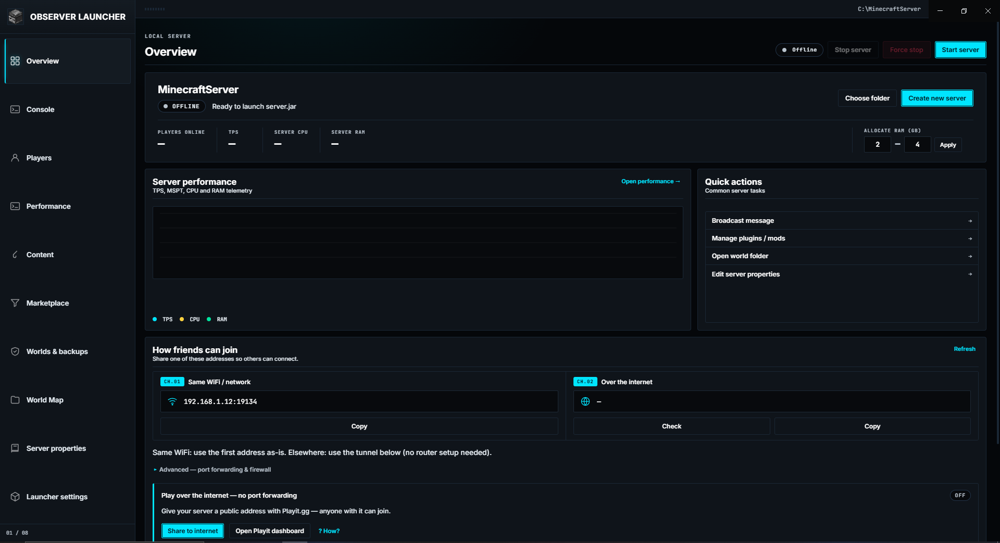
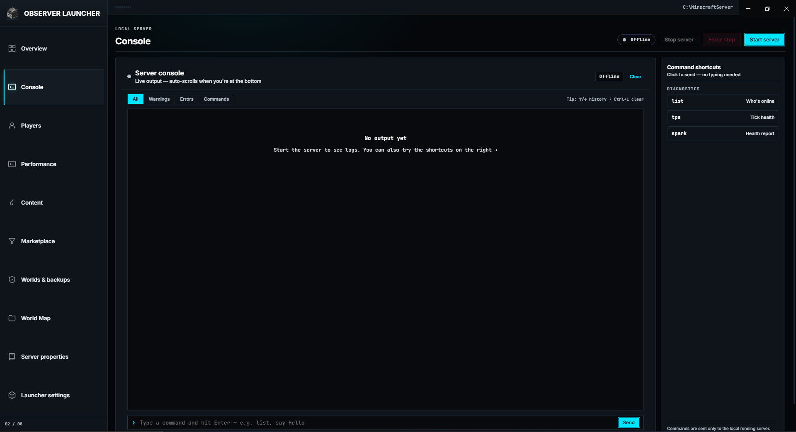
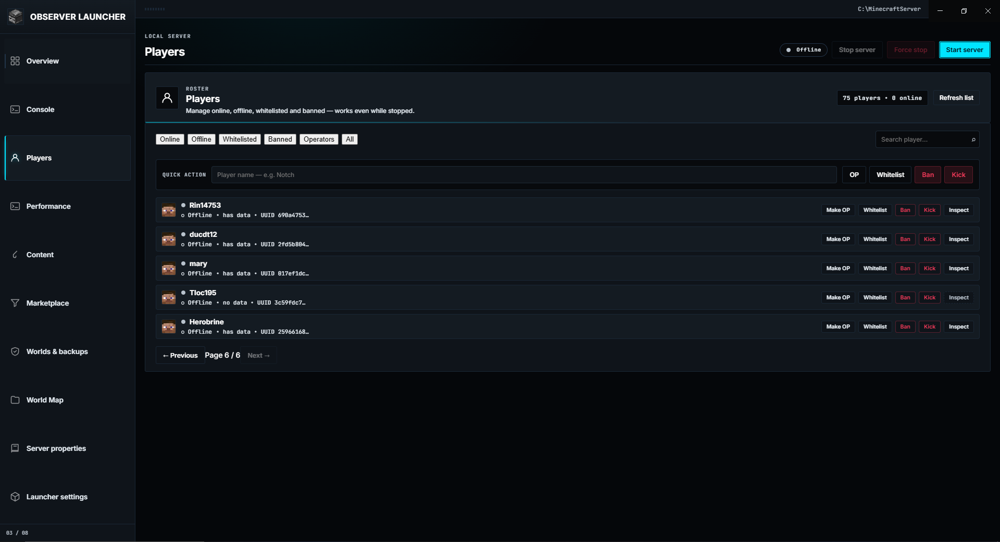
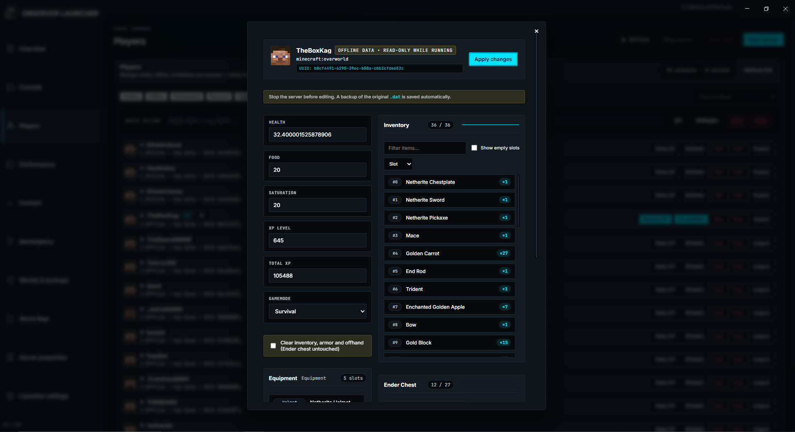
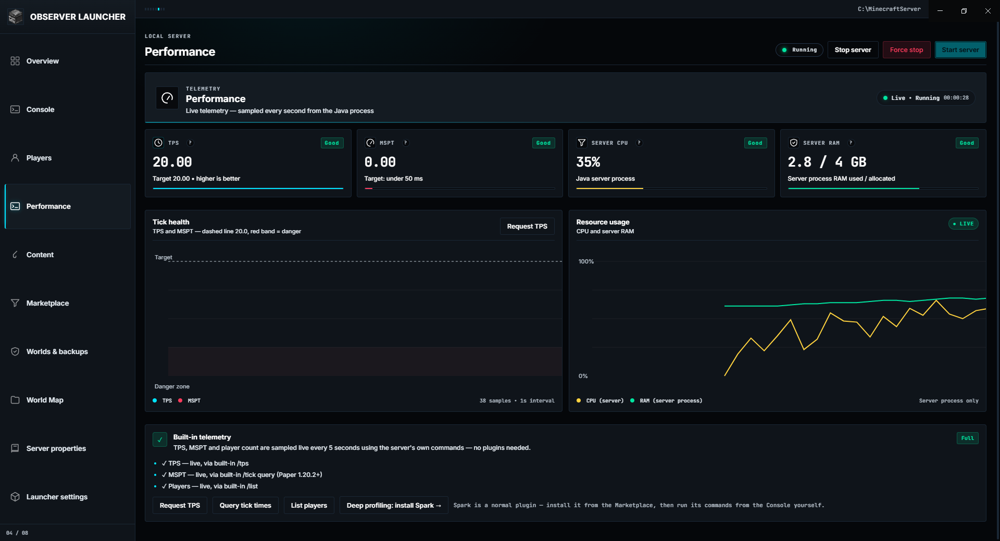
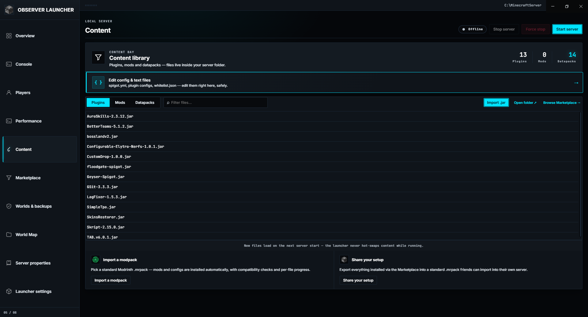
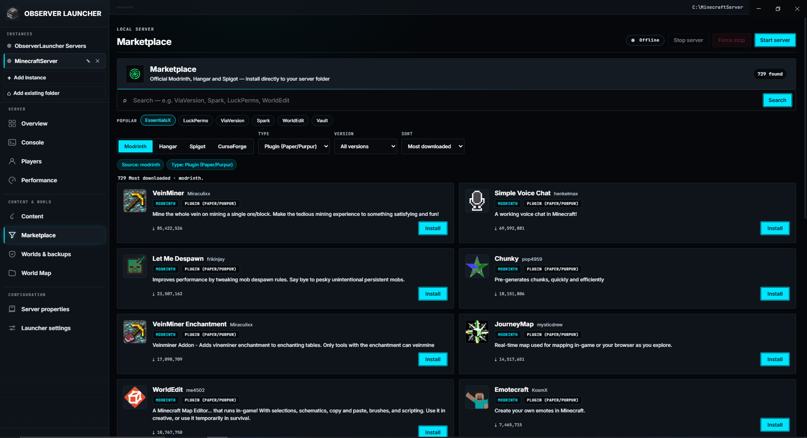
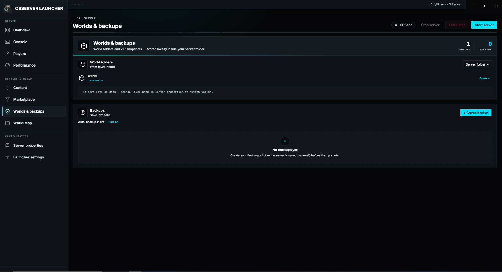
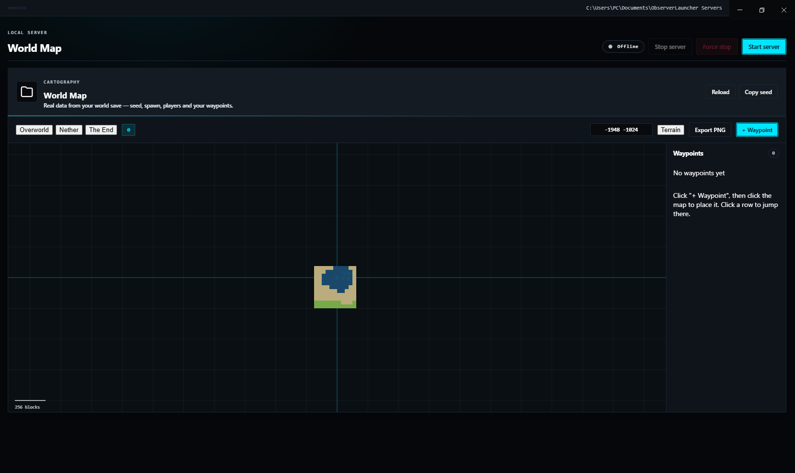
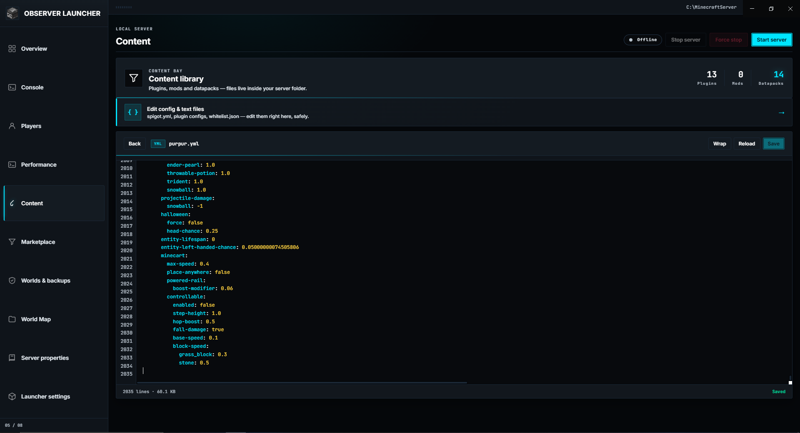

# ObserverLauncher

Run a Minecraft: Java Edition server on Windows or Linux without a terminal.

ObserverLauncher handles the setup work around hosting: it downloads the server software, installs Java, edits config files, opens the firewall, and backs up worlds. You pick a folder, choose a server type, and press Start. Everything runs on your own machine. There is no account and no cloud component.

[](https://github.com/Kag4286/ObserverLauncher/releases/latest)
[](https://github.com/Kag4286/ObserverLauncher/actions/workflows/test.yml)
[](LICENSE)
[](https://github.com/Kag4286/ObserverLauncher/releases/latest)

> Since 1.0.0 the project favours stability and polish over new features. Changes are listed in the [CHANGELOG](CHANGELOG.md).

[Install](#install) · [Quick start](#quick-start) · [Features](#features) · [Troubleshooting](#troubleshooting) · [Architecture](#architecture)

## Install

Download the latest release:

| Platform | File |
|---|---|
| Windows 10/11 (64-bit) | `ObserverLauncher-2.3.0-setup.exe` |
| Linux (AppImage) | `ObserverLauncher-2.3.0.AppImage` |

**Windows:** run the installer. It sets up auto-update.

**Linux:** `chmod +x ObserverLauncher-2.3.0.AppImage`, then run it. No root needed.

From source:

```bash
npm install
npm start
```

Auto-update checks GitHub Releases at startup. It works with the NSIS installer and the AppImage, not with a portable `.exe` or a `.deb`, and only for published releases.

## Requirements

| | Minimum | Recommended |
|---|---|---|
| OS | Windows 10 (64-bit) or a modern 64-bit Linux distro | Windows 11 / recent Ubuntu, Fedora |
| RAM | 4 GB | 8 GB or more |
| Disk | ~1 GB | 5 GB or more |
| Java | Any; the launcher can detect and install it | 64-bit Java 17 / 21 / 25, matching the server version |
| Git | Only to compile Spigot | Install it if you use Spigot |

No admin rights are needed. Java installs into your user folder, and elevation is requested only if you open the Windows Firewall for a port. Running from source needs Node.js 18 or newer.

## Quick start

1. Launch the app. The first run opens the Overview tab with a welcome card.
2. Choose an empty folder, or use **Create new server** to suggest one under `Documents/ObserverLauncher Servers`. The launcher never overwrites an existing server jar.
3. Run the wizard: pick the software (for example Paper) and a Minecraft version. Spigot compiles from source and takes several minutes; progress shows in the Console.
4. Fix anything the setup checklist flags: missing folder, jar, Java, or unaccepted EULA. The list hides itself when all are green.
5. Accept the EULA, either with **Accept EULA automatically** in Settings or by editing `eula.txt`.
6. Set memory in the **Server stats** panel at the bottom of Overview, then press **Start**. The first launch creates `server.properties` and the world folders. A single `Failed to load properties` message on that first run is expected.
7. To invite friends, use the **How friends can join** panel. On the same Wi-Fi, share the local address. Otherwise, forward the port or click **Share to internet** (Playit.gg), which needs no router setup.

Plugins, players, backups and the world map are optional.

## Screenshots

### Desktop App

<table>
<tr>
<td align="center" width="50%"><b>Overview</b><br></td>
<td align="center" width="50%"><b>Console</b><br></td>
</tr>
<tr>
<td align="center"><b>Players</b><br></td>
<td align="center"><b>Player inspector</b><br></td>
</tr>
<tr>
<td align="center"><b>Performance</b><br></td>
<td align="center"><b>Content library</b><br></td>
</tr>
<tr>
<td align="center"><b>Marketplace</b><br></td>
<td align="center"><b>Worlds and backups</b><br></td>
</tr>
<tr>
<td align="center"><b>World Map</b><br></td>
<td align="center"><b>Editor</b><br></td>
</tr>
</table>

## Features

### Server setup
- Downloads Vanilla, Paper, Purpur, Leaf, Fabric, Forge, NeoForge, Folia, Velocity or Spigot from official sources.
- Loads version lists live from each project's API, so new Minecraft releases appear without an app update.
- Checks installed Java against the jar's requirement before start (a 26.x jar needs Java 25; an old 1.12.2 jar needs Java 8) and blocks the start with a clear message when it is too old.
- Installs Java automatically, with no admin rights.
- Compiles Spigot from source via BuildTools. This needs Git and takes several minutes.

### Live monitoring
- Real-time TPS, MSPT, CPU and RAM graphs, with a plain-language explanation behind the **?** next to each KPI.
- Native for Paper, Purpur, Leaf, Folia and Forge. Vanilla and Fabric show player count only.

### Players
- One roster for online, whitelisted, banned and OP players. Whitelist, ban and OP toggles work while the server is stopped.
- Player inspector has three tabs: **Overview** (read-only stats, equipment, inventory, ender chest), **Live actions** (gamemode, XP, give, heal, feed, clear, kick, while the server runs), and **Saved data** (edit health, XP, food or game mode in the `.dat`; the server must be stopped, and a backup is written first).
- Handles modern (1.21.5+ / 26.x) saves, where armour and the off-hand item moved into the `equipment` NBT tag.

### Marketplace
- Searches Modrinth, Hangar, SpigotMC and CurseForge in one box. CurseForge is optional and needs your own free API key (Settings → Advanced), stored locally and sent only to CurseForge.
- Projects whose author blocks third-party downloads show an **Open page** button instead of Install.
- Shows compatibility (game version, loader, server-side support) against the detected server before install.
- Version picker with per-file download progress.
- Modrinth dependency awareness: required dependencies are listed with an installed tick, incompatibilities are flagged, and a one-click **Install required dependencies** fills the gaps. Optional dependencies are listed but never auto-installed.
- Imports and exports Modrinth `.mrpack` files. Import warns on a declared version or loader mismatch but is never blocked. Export writes real dependencies.

### Config editor
- Edits `server.properties`, `spigot.yml`, `whitelist.json`, plugin configs and more, in place.
- Collapsible folder tree for large server folders; search still shows full paths.
- Syntax highlighting for YAML, JSON, TOML, properties and JS, with JSON validation and formatting.
- Warns when a file changed on disk while it was open.
- Velocity proxies get a raw `velocity.toml` editor instead of the properties grid.

### Backups
- Manual or scheduled ZIP snapshots of world folders, using `save-off` / `save-all` / `save-on` so worlds are not archived mid-write.
- Restore from the launcher, with a zip-slip safety check on extraction.

### World Map
- Reads real data from the world save, not a mock-up: seed, level name, version and spawn from `level.dat`, and player positions with a distinct spawn marker.
- Terrain and biome preview from each chunk's own heightmap and the region files' biome palette (1.18+ paletted containers). The spawn area is prefetched.
- Explored-chunk overlay scanned from region files, filtering out half-generated chunks.
- Waypoints you can add, name, jump to and delete, plus jump-to-coordinates.
- Exports the current view as PNG.
- On modded servers, custom biomes get stable approximate colours, and a note names any custom dimensions the map cannot draw.

### Console
- Live terminal with timestamps, a per-line level badge (CMD / INF / WRN / ERR) and segmented filters.
- Search box that filters the log as you type.
- Auto-scroll toggle: stay pinned to the newest line or read history without being pulled down.
- Command history (↑/↓), a recent-commands row, and log export to `.txt`.
- Auto-poll noise (`list`, `tps`, `tick query`) is filtered out.

### Tunnel
- The **How friends can join** panel shows the LAN address immediately and looks up the public IP on demand.
- **Share to internet** starts the Playit.gg agent (downloaded automatically if missing) for a public address with no router setup, and can auto-start with the server.

### Schedule
- Starts and stops the server on a daily window with optional weekdays.
- Uses the local clock, so a scheduled action is skipped if the PC is asleep. A scheduled stop never interrupts a backup and is treated as manual, so auto-restart does not revive it.

### Downloads
- Retries and resumes (HTTP Range) when a connection drops. A slow but alive download is not killed by a wall-clock timeout.
- Wizard downloads are cancellable, and Java installs into a staging folder so a failed extract cannot wipe a working Java.

### Multi-instance
- Manages several servers from one window, each with its own folder, Java runtime, RCON, schedule, backups and tunnel.
- A rail lists the instances and shows each one's status. A settings table shows every instance's public tunnel address.
- Java detection is per instance, so servers needing different Java versions can run at the same time.

### MCP / AI integration
- Acts as an MCP server so an AI client can read and control the server in natural language (66 tools). See [MCP / AI integration](#mcp--ai-integration).

## MCP / AI integration

ObserverLauncher can act as an MCP server, letting an MCP client read and control your server in natural language, with 66 tools.

**Modpack builder.** The AI can search the marketplace, then `plan_modpack` turns candidates into an install plan with exact versions, per-item compatibility warnings, and required Modrinth dependencies. After you approve it, `assemble_modpack` installs the list in one confirmation and reports each item. The AI only picks ids; versions, URLs and hashes are resolved by the app from the registry.

**Server Doctor.** The AI can run a health check (`doctor_report` / `diagnose_server`), scan the console (`analyze_console`), summarise the newest crash report (`explain_crash`), check TPS/MSPT (`check_performance`), validate `server.properties`, test the port, and run composite workflows (`prepare_and_start`, `safe_restart`). Every write and destroy call is written to an audit log the AI can read back (`read_audit_log`).

**Enable it:** Settings → **Advanced** → **MCP / AI** → *Enable MCP server*. The launcher starts a local-only server (127.0.0.1, random port, a fresh token each launch) and writes its connection info to `mcp-bridge.json` in the launcher's data folder. The app must stay open while the client is used.

**Connect a client:** click **Copy MCP config** and paste it into your client's MCP settings. The launcher runs the bridge with its own binary (`ELECTRON_RUN_AS_NODE=1`), so Node.js is not required.

**Permissions.** Tools have three tiers. Read tools run freely. Write tools (install, edit files, send a command) ask for confirmation first, which *Auto-allow write tools* can skip. Destructive tools (stop, delete, restore, `safe_restart`) always ask and cannot be auto-approved. A Read-only mode setting blocks every write and destructive tool up front. A per-tool rate limit (60/min) prevents runaway loops, and every write and destroy call is written to an audit log.

Nothing is exposed beyond `127.0.0.1`, and the token changes every launch.

## Supported server software

| Software | Source | Native TPS/MSPT |
|---|---|---|
| Vanilla | Mojang version manifest | Player count only |
| Paper / Folia / Velocity | PaperMC Fill API | Yes (Velocity is a proxy) |
| Purpur | Purpur API | Yes |
| Leaf | Leaf API | Yes |
| Fabric | Fabric meta API | Player count only |
| Forge / NeoForge | Official installer | Yes |
| Spigot / CraftBukkit | Compiled via BuildTools (needs Git) | Via Spigot config |

## Languages

English, Tiếng Việt, Español, Português (BR), Deutsch, Русский, 简体中文.

All 7 are fully translated. A missing key falls back to English.

## Where things live

A typical Paper or Fabric server folder:

```
MyServer/
├── paper-1.21.4.jar          # the server jar (or run.bat / run.sh for Forge/Fabric)
├── eula.txt                  # Minecraft EULA acceptance
├── server.properties         # main config
├── spigot.yml / bukkit.yml   # Spigot/Paper config (if applicable)
├── plugins/                  # plugins (.jar)
├── mods/                     # mods (.jar) for Forge/Fabric
├── world/                    # overworld + playerdata + datapacks
├── world_nether/             # nether
├── world_the_end/            # the end
├── logs/                     # server logs
├── usercache.json            # known players
├── whitelist.json / banned-players.json / ops.json
├── observerlauncher-backups/ # ZIP backups created by the launcher
└── observerlauncher-manifest.json  # tracks marketplace installs (for export)
```

Newer Minecraft versions may store player data under `world/players/data/` instead of `world/playerdata/`. The launcher reads both.

Launcher data lives outside the server folder, in Electron's `userData` directory (on Windows usually `C:\Users\<you>\AppData\Roaming\ObserverLauncher`, on Linux `~/.config/ObserverLauncher`): `settings.json`, downloaded item and block icons under `textures/`, and update state.

## Troubleshooting

**Java not detected.** Install it from **Settings → Java runtime → Install Java automatically**, or set the path manually. If `java -version` does not work in a terminal, the launcher will not see it either.

**"This jar needs Java X+, detected Java Y".** The jar requires a newer Java. Use **Fix Java**, or install manually. Minecraft now uses calendar versioning: 26.x needs Java 25, 1.20.5+ and 1.21.x need Java 21, 1.18+ needs Java 17, older needs Java 8.

**TPS / MSPT show "—".** Only Paper, Purpur, Leaf, Folia and Forge have a built-in TPS/MSPT command. For Vanilla and Fabric, install Spark from the Marketplace.

**The server will not start and shows no clear error.** Check the Console tab and scroll up; the real Java error is usually a few lines above. Common causes are a Java version mismatch, too little RAM, or a corrupted jar.

**"Failed to load properties" on first start.** Expected. `server.properties` does not exist yet, the server complains once, creates it, and continues.

**Start button greyed out.** Hover it. The tooltip says why (no folder, no runnable jar, or Java not detected). The Overview checklist lists the same.

**Spigot build fails.** Spigot has no pre-built download and is compiled locally with BuildTools, which needs Git on your PATH. Install Git from [git-scm.com](https://git-scm.com) and retry. It can take several minutes.

**Friends cannot connect over the internet.** Opening the Windows Firewall is only half the job. Forward the port on your router, or use **Share to internet** (Playit.gg), which needs no router setup. Some ISPs use carrier-grade NAT, where port forwarding does not work at all.

**The app is stuck on "Stopping…".** Use **Force stop** in the top bar. It kills the server process tree immediately and confirms first, since unsaved progress may be lost.

**Auto-update not working.** Make sure you installed via the NSIS installer or AppImage, not a portable `.exe` or `.deb`, and that the GitHub release is published rather than a draft.

## FAQ

**Do I need to own Minecraft to run a server?** The server software is free. Players need a legitimate Java Edition account if the server runs in online mode, which is the default. Turning online mode off allows cracked clients.

**Does the launcher host the server for me?** No. It runs on your computer; the launcher is the control panel.

**Can I run more than one server?** Yes. Add each server folder as its own instance. Each instance has its own folder, Java runtime, RCON, schedule, backups and tunnel.

**Where are my backups?** In the server folder under `observerlauncher-backups/`, as `.zip` files.

**Can I use this on a Mac?** Not officially. Windows and Linux only.

**Does it work with Bedrock?** No. Java Edition only.

**How much RAM should I allocate?** For a few friends, 2 to 4 GB is enough, leaving at least 2 GB for the OS. The launcher defaults to roughly half your system RAM, capped at 8 GB.

**Can I edit configs by hand?** Yes. Everything is a normal file, and the launcher detects external changes while a file is open in its editor.

## Data and privacy

ObserverLauncher is a local tool with no account, no telemetry and no analytics.

Downloads happen only when you ask: server jars from official Mojang, PaperMC, Purpur, Leaf, Fabric and Forge endpoints; plugins and mods from Modrinth, Hangar and SpigotMC; item and block icons from the public PrismarineJS mirror, cached locally (no Mojang assets are bundled or redistributed); Java runtimes when you use auto-install; and update metadata from GitHub Releases.

The app never uploads your world, configs or player data, never collects usage statistics, and runs no background service once closed. All requests go directly from your machine to the official sources.

## Known limitations

- Windows and Linux only. No macOS build.
- TPS/MSPT need a supported server. Vanilla and Fabric report player count only.
- Spigot needs Git and a full JDK, and compiles slowly.
- Velocity proxies do not tick a world, so their TPS/MSPT panel shows N/A.
- Auto-update requires the packaged installer or AppImage, not a portable `.exe` or `.deb`.
- Port forwarding is still your responsibility by default. The launcher cannot configure your router. **Share to internet** (Playit.gg) avoids the router but links the machine to a Playit account.
- The World Map is heavy on the CPU. Panning and zooming can slow the app and briefly affect a running server; a note in the tab explains this.

### Linux notes

Linux is supported but has not been verified on real hardware. The platform code is code-analysed and unit-tested only, so treat the Linux build as less battle-tested than Windows.

- The firewall is not opened for you. The button copies `sudo ufw allow <port>/tcp` to the clipboard; the launcher never requests sudo.
- Backups need `zip` or `tar`. If neither is present, the launcher tells you what to install.
- Auto-update works only for the AppImage.
- Stopping uses SIGTERM, with a `/proc` walk and SIGKILL fallback.
- Spigot's BuildTools needs a JDK, not just the JRE the auto-installer provides.

## Architecture

The app is a three-layer split.

```
RENDERER  (src/renderer/)  UI only, no Node access
  index.html loads css/* then locales/* then js/* in numeric order
  js/00-core ... js/13-bootcheck (classic scripts, no bundler)
        |
        |  window.observer.*  (IPC)
        v
PRELOAD  (src/preload.js)  contextBridge, the only bridge
  contextIsolation ON, nodeIntegration OFF, sandbox ON
        |
        |  ipcMain.handle(...)
        v
MAIN  (src/main.js)  thin composition root
  creates ctx and registers feature modules:
    context, server-lifecycle, backups, players, marketplace, modpacks,
    wizard, settings-handlers, content-handlers, tunnel, scheduler, app-lifecycle
  Pure helpers: java, server-files, settings, fs-utils, http, editor,
    worldmap, textures, validate, migrations
  Per-software resolvers: adapters/
  Per-OS process/metrics/firewall: platform/
  MCP server + stdio bridge: mcp/
```

- `src/main/context.js` holds the shared mutable state object (`ctx`) plus helpers such as `send`, `appendLog` and `setServerStatus`. Every status change goes through `setServerStatus`.
- IPC channel names are stable and shared with `preload.js`. Do not rename them; the renderer depends on them.
- Most `src/main/*` modules are plain, side-effect-free functions you can `require()` in a test without an Electron window.
- The renderer has no `require()`. It mirrors input validation manually (see `validate.js` against `js/00-core.js`), and the backend re-validates as defence in depth.

## Development

### Tests

```bash
npm test          # unit tests (plain Node, no framework)
npm run test:e2e  # Playwright end-to-end (real Electron app)
```

The unit suite covers boot state, editor safety rails, force-stop, input validation, Java/version mapping, metric parsing, marketplace and poll suppression, the world map (including heightmap helpers and modded-dimension detection), player equipment (old and new NBT layouts), download resume, explored-chunk filtering, the scheduler, modpack compatibility, and MCP (tool registry, HTTP server, stdio bridge).

E2E boots the real app and drives real flows: a full tab and modal tour that must stay free of renderer errors, the Settings sub-tab glider, language switching, motion-level persistence across a reload, and, against a throwaway fixture server folder, the Content list, the file-browser and editor round-trip, and the Properties editor. The suite runs offline; boot skips the network version fetch and the real Java probe under `OBSERVER_E2E=1`.

### Build

```bash
npm run build:win     # Windows NSIS installer
npm run build:linux   # Linux AppImage
npm run build:all     # both
```

Releases are automated via GitHub Actions when you push a `v*` tag.

### Conventions

- English only in code comments, commit messages, and the `en` locale block.
- One concern per pull request.
- Explain the why, not just the what, in PR descriptions, especially for bug fixes.
- Test on Windows if you can. Several paths (`powershell.exe`, `cmd.exe`, `run.bat`) are Windows-specific.

### Project structure

```
ObserverLauncher/
├── src/
│   ├── main.js          # Electron main process (thin wiring)
│   ├── preload.js       # Safe IPC bridge
│   ├── main/            # Backend modules (see Architecture above)
│   │   ├── adapters/    # Server software download resolvers
│   │   └── platform/    # Windows/Linux process, metrics, firewall
│   └── renderer/        # UI
│       ├── index.html   # Shell (loads css/*, locales/*, js/* in order)
│       ├── js/          # Frontend per tab (00-core ... 13-bootcheck)
│       ├── css/         # Styles per area (01-tokens ... 09-pulse)
│       └── locales/     # One file per language (meta.js first)
├── tests/               # Unit tests (node tests/run.js)
├── docs/                # Screenshots
├── build/               # App icons
└── package.json
```

## Contributing

Issues and pull requests are welcome. Read [CONTRIBUTING.md](CONTRIBUTING.md) first; it covers the development setup, the one-concern-per-PR rule, and how to add a language.

A useful bug report includes what you clicked, what you expected, and the actual Console output (the launcher's Console tab, or `logs/latest.log` if the server itself failed).

## AI contributions

The project is developed with AI tools (DeepSeek, Claude, ChatGPT, Qwen) for code generation, debugging and documentation. All AI-generated code is reviewed and tested by humans before merging.

## License

[MIT](LICENSE) © ObserverLauncher contributors.

## Disclaimer

ObserverLauncher is an unofficial tool, not affiliated with, endorsed by, or associated with Mojang, Microsoft, or any server-software project (Paper, Purpur, Fabric, Forge, Spigot). Minecraft is a trademark of Mojang Synergies AB.

Running a Minecraft server requires accepting the [Minecraft End User License Agreement](https://www.minecraft.net/en-us/eula). No Mojang game assets are bundled in this repository; item and block icons are fetched at runtime from a public mirror.
