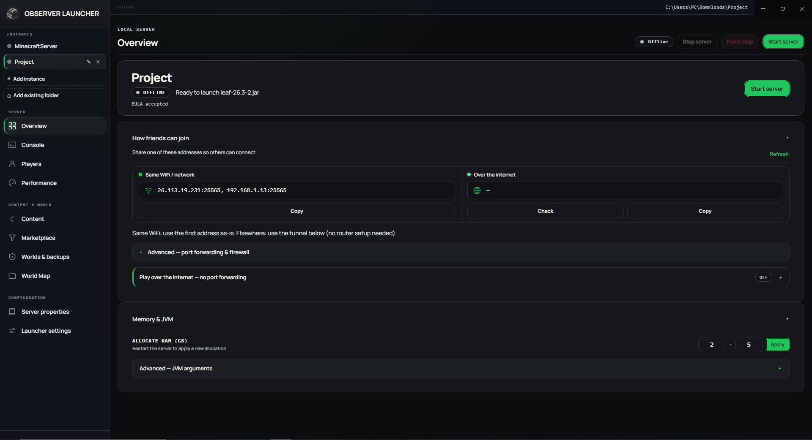
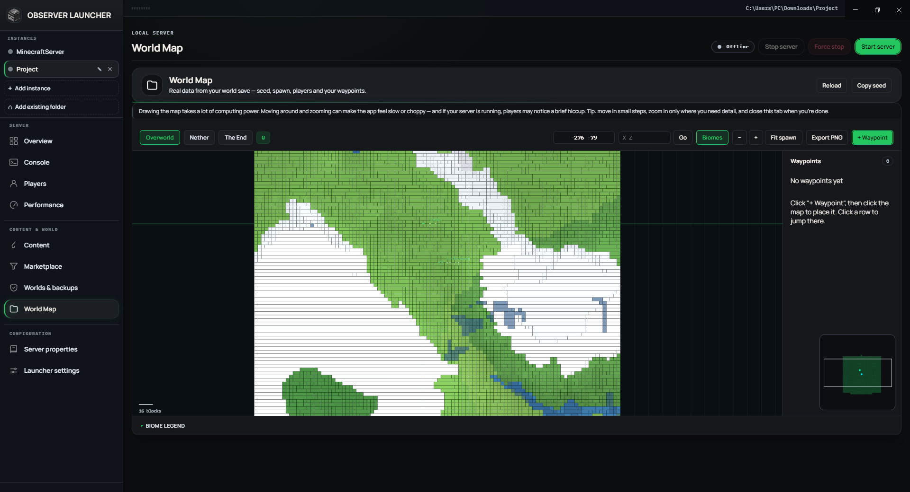

# ObserverLauncher

A desktop app for running a Minecraft: Java Edition server on Windows or Linux. It handles the setup around hosting: downloading the server software, installing Java, editing configs, opening the firewall, and backing up worlds. Pick a folder, choose a server type, press Start.

Everything runs locally. No account, no telemetry, no cloud service.

[](https://github.com/Kag4286/ObserverLauncher/releases/latest)
[](https://github.com/Kag4286/ObserverLauncher/actions/workflows/test.yml)
[](LICENSE)
[](https://github.com/Kag4286/ObserverLauncher/releases/latest)

> Website: [observerlauncher-site.kag4286.workers.dev](https://observerlauncher-site.kag4286.workers.dev). Per-release notes are in [CHANGELOG.md](CHANGELOG.md).

## Install

Download the latest release:

| Platform | File |
|---|---|
| Windows 10/11 (64-bit) | `ObserverLauncher-4.2.0-setup.exe` |
| Linux (AppImage) | `ObserverLauncher-4.2.0.AppImage` |

Windows: run the installer, which sets up auto-update. Linux: `chmod +x ObserverLauncher-4.2.0.AppImage` and run it. No root needed.

From source (Node.js 18 or newer):

```bash
npm install
npm start
```

Auto-update uses GitHub Releases and works with the NSIS installer and the AppImage. Portable `.exe` and `.deb` builds do not update themselves.

## Quick start

1. Launch the app. The first run opens the Overview tab.
2. Pick an empty folder, or click **Create new server** to make one under `Documents/ObserverLauncher Servers`.
3. Run the wizard: choose the server software and a Minecraft version. Spigot compiles from source and takes a few minutes; progress shows in the Console.
4. Accept the Minecraft EULA (the app can do this on first start).
5. Set memory and press **Start**.

To let friends join, open **How friends can join**. On the same network, share the local address. Otherwise forward the port on your router, or click **Share to internet** (Playit.gg) for a public address with no router setup.

## Screenshots

<table>
<tr>
<td align="center" width="50%"><b>Overview</b><br></td>
<td align="center" width="50%"><b>World map</b><br></td>
</tr>
</table>

More screenshots are on the [website](https://observerlauncher-site.kag4286.workers.dev).

## What it does

**Server setup.** Downloads Vanilla, Paper, Purpur, Leaf, Folia, Fabric, Forge, NeoForge, Spigot or Velocity from official sources. Version lists load live from each project's API, so new Minecraft releases appear without an app update. The app checks that your Java matches the jar before starting and can install Java automatically.

**Console.** Live output with timestamps, level filters, search, command history, a recent-commands row and log export.

**Performance.** TPS, MSPT, CPU and RAM graphs. Paper, Purpur, Leaf, Folia and Forge report TPS natively; Vanilla and Fabric need Spark.

**Players.** One roster for online, whitelisted, banned and OP players. The inspector reads equipment, inventory and ender chest, runs live actions (gamemode, XP, give, heal, feed, kick), and edits saved data when the server is stopped.

**Marketplace.** Search Modrinth, Hangar, SpigotMC and CurseForge in one box. Compatibility is checked against the detected server before install. Modrinth dependencies are resolved, and `.mrpack` files can be imported and exported.

**Content editor.** Edit `server.properties`, `spigot.yml`, plugin configs, `whitelist.json` and more, with syntax highlighting and JSON validation. A collapsible folder tree keeps large server folders manageable.

**World map.** Renders terrain and biomes from your world save, with waypoints, an explored-chunk overlay, jump-to-coordinates and PNG export.

**Backups.** Manual or scheduled ZIP snapshots of world folders, taken with `save-off` / `save-all` so worlds are not archived mid-write. Restore is built in and zip-slip checked.

**Multi-instance.** Run several servers at once. Each instance has its own folder, Java runtime, RCON, schedule, backups and tunnel.

## Server software

| Software | Source | TPS/MSPT |
|---|---|---|
| Vanilla | Mojang version manifest | Player count only |
| Paper, Folia, Velocity | PaperMC Fill API | Yes |
| Purpur | Purpur API | Yes |
| Leaf | Leaf API | Yes |
| Fabric | Fabric meta API | Player count only |
| Forge, NeoForge | Official installer | Yes |
| Spigot | Compiled via BuildTools (needs Git) | Via Spigot config |

## Languages

English, Tiếng Việt, Español, Português (BR), Deutsch, Русский, 简体中文. All fully translated; a missing key falls back to English.

## Requirements

| | Minimum | Recommended |
|---|---|---|
| OS | Windows 10 (64-bit) or a modern 64-bit Linux distro | Windows 11 or a recent Ubuntu/Fedora |
| RAM | 4 GB | 8 GB or more |
| Disk | ~1 GB | 5 GB or more |
| Java | Any (the app can detect and install it) | 64-bit Java 17, 21 or 25, matching the server |
| Git | Only to compile Spigot | Install it if you use Spigot |

No admin rights are needed. Java installs into your user folder; elevation is requested only when opening the Windows Firewall for a port.

## Troubleshooting

**Java not detected.** Install it from Settings, or set the path manually. If `java -version` fails in a terminal, the app will not see it either.

**"This jar needs Java X+, detected Java Y".** The jar wants a newer Java. Minecraft now uses calendar versioning: 26.x needs Java 25, 1.20.5+ and 1.21.x need Java 21, 1.18+ needs Java 17, older needs Java 8.

**The server will not start, with no clear error.** Open the Console and scroll up. The real Java error is usually a few lines above. Common causes are a Java version mismatch, too little RAM, or a corrupted jar.

**"Failed to load properties" on first start.** Expected. `server.properties` does not exist yet, so the server complains once, creates it and continues.

**Start button greyed out.** Hover it. The tooltip says why (no folder, no runnable jar, or Java not detected).

**Spigot build fails.** Spigot has no pre-built download and is compiled locally with BuildTools, which needs Git on your PATH. Install Git from [git-scm.com](https://git-scm.com) and retry.

**Friends cannot connect over the internet.** Opening the Windows Firewall is only half the job. Forward the port on your router, or use **Share to internet** (Playit.gg). Some ISPs use carrier-grade NAT, where port forwarding does not work at all.

**The app is stuck on "Stopping…".** Use **Force stop** in the top bar. It kills the server process tree immediately and asks first, since unsaved progress may be lost.

## Data and privacy

ObserverLauncher is a local tool with no account, no telemetry and no analytics. Downloads happen only when you ask, and only from official sources: server jars from Mojang, PaperMC, Purpur, Leaf, Fabric and Forge; plugins and mods from Modrinth, Hangar and SpigotMC; item and block icons from the public PrismarineJS mirror (no Mojang assets are bundled or redistributed); Java runtimes when you use auto-install; and update metadata from GitHub Releases. Nothing is uploaded, and the app runs no background service once closed.

Launcher data lives outside the server folder, in Electron's `userData` directory (`%APPDATA%\ObserverLauncher` on Windows, `~/.config/ObserverLauncher` on Linux). Set `OBSERVER_DATA_DIR` to move it.

## Known limitations

- Windows and Linux only. No macOS build.
- TPS/MSPT need a supported server. Vanilla and Fabric report player count only.
- Spigot needs Git and a full JDK, and compiles slowly.
- Velocity proxies do not tick a world, so their TPS/MSPT panel shows N/A.
- Auto-update requires the packaged installer or AppImage.
- Port forwarding is your responsibility unless you use Playit.gg.
- The world map is CPU-heavy. Panning and zooming can briefly affect a running server.

## For developers

The app has three layers: renderer (UI, no Node access), preload (the only IPC bridge), and main (Electron, a thin composition root that registers feature modules from `src/main/`). A headless entry point (`src/headless.js` plus `src/cli.js`) runs the same backend without Electron.

```
src/renderer/   UI (html + css + locales + js, loaded in numeric order)
src/preload.js  IPC bridge (contextIsolation on, nodeIntegration off, sandbox on)
src/main.js     main process; registers feature modules
src/main/       backend modules, adapters/ per server software, platform/ per OS
src/mcp/        MCP server, stdio bridge, doctor and repair
src/headless.js no-window entry point
src/cli.js      observer command
```

IPC channel names are stable and shared with `preload.js`. Do not rename them.

### Headless and CLI

```bash
node src/headless.js
OBSERVER_DATA_DIR=/var/lib/observer node src/headless.js
```

The `observer` command maps one command per MCP tool:

```bash
observer status
observer start
observer players
observer install luckperms
observer init --template modded-performance
```

Flags: `--json` for scripts, `--instance <id>` to target an instance, `--help`, `--version`.

### MCP and AI integration

The app can act as an MCP server, letting a client read and control the server over 75 tools. Enable it in Settings under MCP / AI. It binds to 127.0.0.1 with a fresh token each launch. Read tools run freely, write tools ask for confirmation, and destructive tools always ask and cannot be auto-approved. Every write and destroy call is written to an audit log.

### Remote access

A loopback-only HTTP server for checking on a running server from another device. It reads status, console and players; the one action endpoint is blocked while Read-only is on (the default). A long-lived token and an optional IP allowlist guard every request. Use Tailscale to reach it from anywhere. Full guide: [docs/remote.md](docs/remote.md).

### Docker

```bash
observer docker create --type fabric --ram 4 --port 25565 --out my-server
cd my-server && mkdir -p server data && docker compose up -d
```

The image runs the headless backend (the launcher is PID 1, the JVM is its child), with the server folder and launcher data in two volumes. Full guide: [docs/docker.md](docs/docker.md).

### Modpack CI/CD

A modpack can be a declarative `modpack.json`, verified in CI before anything is downloaded.

```bash
observer modpack verify modpack.json   # resolve items, check loader/MC, deps
observer modpack build modpack.json --out my-server
```

Full guide: [docs/modpack.md](docs/modpack.md).

### Tests

```bash
npm test          # unit tests (plain Node, no framework)
npm run test:e2e  # Playwright end-to-end against the real app
```

### Build

```bash
npm run build:win     # Windows NSIS installer
npm run build:linux   # Linux AppImage
npm run build:all
```

Releases are automated through GitHub Actions on a `v*` tag.

## Contributing

Issues and pull requests are welcome. Read [CONTRIBUTING.md](CONTRIBUTING.md) first. A useful bug report includes what you clicked, what you expected, and the Console output.

## License

[Apache-2.0](LICENSE) © ObserverLauncher contributors. See [NOTICE](NOTICE) for third-party attributions.

ObserverLauncher is an unofficial tool. It is not affiliated with, endorsed by or associated with Mojang, Microsoft, or any server-software project. Minecraft is a trademark of Mojang Synergies AB. Running a server requires accepting the [Minecraft EULA](https://www.minecraft.net/en-us/eula).
